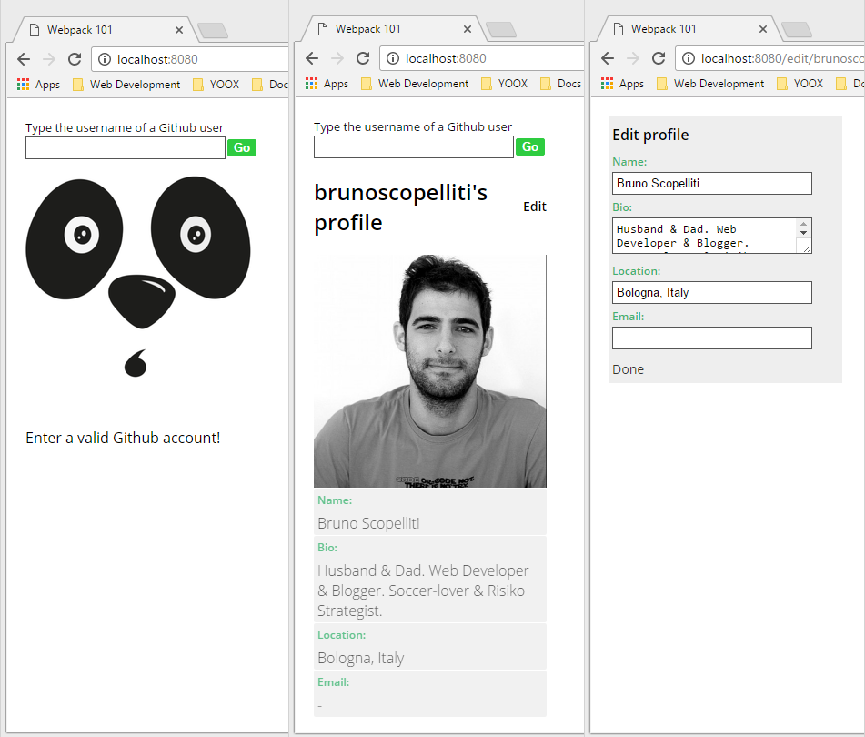

# webpack-101
A progressive webpack configuration demo/tutorial. 

##webpack
webpack is a **module bundler**; it takes modules with dependencies and
 generates static assets representing those modules.

The [webpack website][wp-getting-started] is probably the best place to
 get an overview of webpack, and discover all its capabilities.
 I firmly suggest you to take it as reference throughout this guide.

webpack is a really powerful, and complex tool; as such, despite the great
 effort, maintainers and the community have put into documentation, it is
 still easy to get lost into its setup.
 That is what happened to me several times.

Surely this guide won't solve everybody's problem with webpack setup; but
 it could be a good starting point to understand webpack better, or even an
 useful reference for the most experienced ones.

###What to expect
I'm not going to approach this like

>That's the configuration file, copy and paste it into your root folder,
>and everything will just be fine!

Instead we're going to build a webpack configuration step by step together.
 We need to understand what we want to achieve with every single setting.
 I won't talk about webpack in the abstract, or about a webpack feature as
 a stand alone piece; instead we're actually going to build a simple single
 page application, and everytime we'll change something into webpack
 configuration, immediately we'll see how this change affects our bundle,
 and our application.

The SPA we're going to build is pretty simple; it permits to render, and
 update the profile's information of every Github user.
 No that's not possible... but we'll arrive pretty close to this.
 

 
 We'll follow what are today considered best practices in front end
 development.
 Gradually we'll introduce React, and then Redux.
 I'll assume you already have a basic understanding of what React, and
 Redux are. The code won't be too much hard to grasp, especially if you
 have experience with other frameworks; otherwise you may want to follow
 before Dan Abramov's free course on egghead.io about [Redux][eh-intro-redux]
 and [React + Redux][eh-react-redux].

During the whole process however the main focus will remain webpack, and
 how to get the most out of it.

###Organizations
You can follow the process of building the app by navigating through the
 history of this repo. In order to simplify the navigation each relevant
 step is in its own branch.
 Branches follow the name convention `${progressive}-${short-description}`.
 For example the next step is `01-webpack-cli`, and to get there you have
 to run the following git command:

```bash
git checkout 01-webpack-cli
```

At each step you'll find only the part of the app that we've built till
 that point.
 We'll start soon another document `webpack101.md`; it will be updated with
 the narrative of what we're doing (and most importantly why).

The last commit, the one you're probably viewing right now, has also the
 code of our completed application... however I encourage you to do not
 consider it right now, and instead go back in time, and start your travel
 through learning webpack.

[wp-getting-started]: http://webpack.github.io/docs/what-is-webpack.html
[eh-intro-redux]: https://egghead.io/courses/getting-started-with-redux
[eh-react-redux]: https://egghead.io/courses/building-react-applications-with-idiomatic-redux